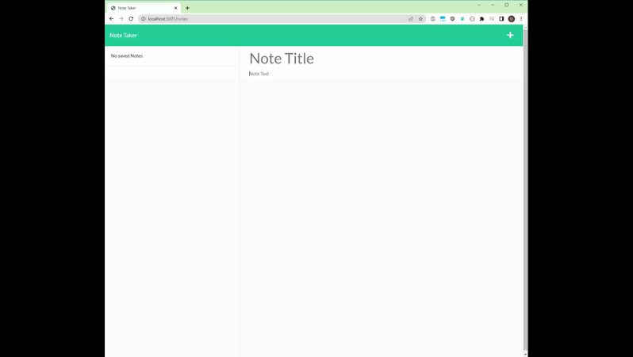

# Note Taker

## Description
A simple to use API was created to create and save notes. 

## Usage
Javascript express was used to create a API for creating and saving notes.
   
  Or view link here - [Screencastify](https://drive.google.com/file/d/1pnJ3jvzdSSAlsxM_T9ukcz8dtmJUgJLQ/view)

## Installation
The user will need to visit the URL of the deployed application at [link](https://calm-refuge-74152.herokuapp.com/)

## Questions
Email dliszka@gmail.com questions regarding the repository.
